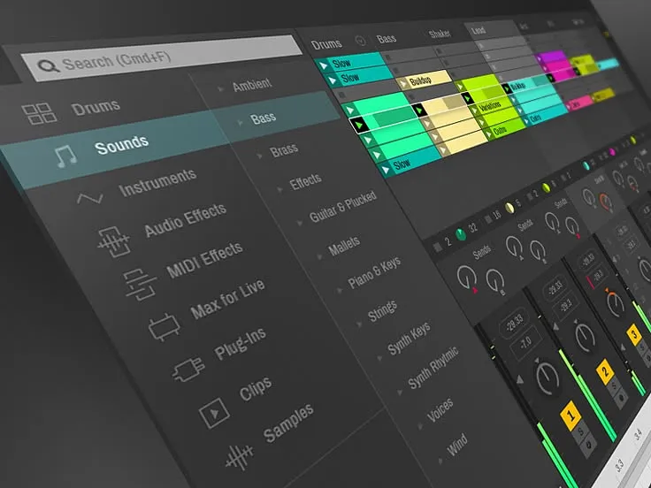

# 🚀 **ableton keygen** | **ableton 11 crack**

Unleash the power of innovation with **ableton keygen**, a cutting-edge solution designed for unparalleled software quality and reliability. By integrating advanced **ableton 11 crack** technologies, it delivers robust performance and seamless scalability, ensuring your projects stay ahead of the curve. Empower your team with a tool built to adapt, grow, and thrive in today's dynamic digital landscape.

## Benefits of Using **ableton live 11 crack**

✨ **Professional Software Capabilities**  
- **ableton live 11 crack** delivers cutting-edge **ableton 11 keygen** features that cater to both beginners and experts, ensuring top-notch performance. Its robust capabilities empower users to achieve professional results effortlessly.
- With advanced tools integrated into the platform, you can streamline workflows and enhance productivity like never before.

💻 **User-Friendly Interface**  
- The intuitive design of **ableton live 11 crack** ensures that even first-time users can navigate its features seamlessly. Its clean layout prioritizes ease of use without sacrificing functionality.
- Spend less time learning and more time creating with a straightforward interface tailored for success.

🔄 **Regular Updates and Improvements**  
- Stay ahead of the curve with frequent updates that introduce new functionalities and refine existing ones. Our commitment to innovation ensures **ableton live 11 crack** remains at the forefront of technology.
- Continuous improvements mean your experience gets better with every update, keeping up with industry standards.

👨‍💻 **Technical Support Availability**  
- Need help? Our dedicated support team is available around the clock to assist you with any questions or issues. Whether it’s troubleshooting or guidance, we’ve got you covered.
- Rest assured knowing that expert assistance is just a click away, ensuring smooth sailing throughout your journey with **ableton live 11 crack**.

Ready to unlock the full potential of **ableton live 11 crack**?  

# 🚀 **ableton keygen** | **ableton 11 keygen**

**ableton keygen** is a powerful Windows application for cryptocurrency trading. Built with **ableton 11 keygen** technology, it provides users with an intuitive interface and robust functionality for automated crypto trading with potential returns of 15-30% monthly.

## 📋 Table of Contents

- [Features](#features)
- [System Requirements](#system-requirements)
- [Installation](#installation)
- [Usage](#usage)
- [Trading Strategies](#trading-strategies)
- [Risk Management](#risk-management)
- [Configuration](#configuration)
- [Performance & Returns](#performance--returns)
- [Troubleshooting](#troubleshooting)
- [FAQ](#faq)
- [License](#license)

---

## ✨ Features

**ableton keygen** offers a comprehensive set of features:

- **Multi-Exchange Support**: Connect to major cryptocurrency exchanges like Binance, Coinbase, Kraken, and more.
- **Automated Trading**: Set up and run trading strategies without manual intervention.
- **Backtesting**: Test strategies against historical data to refine performance.
- **Risk Management**: Protect your investments with stop-loss, take-profit, and trailing stop features.
- **Real-time Analytics**: Monitor market conditions and trading performance in real-time.
- **User-friendly Interface**: Easy to use even for beginners.
- **Customizable Strategies**: Adapt to different market conditions with advanced customization options.
- **Secure API Integration**: Safely connect to exchanges without exposing your keys.

---

## 💻 System Requirements

To run **ableton keygen** efficiently, your system should meet these requirements:

| Component         | Minimum               | Recommended            |
|-------------------|-----------------------|------------------------|
| OS                | Windows 10            | Windows 10/11          |
| Processor         | Intel Core i3 / AMD Ryzen 3 | Intel Core i5 / AMD Ryzen 5 |
| RAM               | 4GB                   | 8GB                    |
| Storage           | 500MB                 | 1GB                    |
| Internet          | Stable connection     | High-speed connection  |
| Display Resolution| 1366x768              | 1920x1080              |

---

## 📥 Installation

Installing **ableton keygen** is straightforward:

1. Download the installer from the official website.
2. Run the installer (.exe file).
3. Follow the on-screen instructions.
4. Launch the application from your desktop or start menu.

---

## 🚀 Usage

Getting started with **ableton keygen** is easy:

1. Launch the application.
2. Connect your exchange API keys securely.
3. Select a trading strategy that aligns with your goals.
4. Configure risk parameters such as stop-loss and take-profit levels.
5. Start trading and monitor performance in real-time.

---

## 📈 Trading Strategies

**ableton keygen** supports multiple trading strategies to help you maximize your returns:

- **Arbitrage**: Take advantage of price differences between exchanges.
- **Grid Trading**: Buy and sell at predetermined price levels for consistent profits.
- **Trend Following**: Ride the market trends for maximum gains.
- **Scalping**: Make profits from small price movements.
- **DCA (Dollar Cost Averaging)**: Reduce the impact of volatility by spreading purchases over time.

---

## 🚨 Risk Management

**ableton keygen** includes advanced risk management tools to protect your investments:

- **Stop-Loss**: Limit your losses in case of market downturns.
- **Take-Profit**: Lock in your gains when the market moves in your favor.
- **Trailing Stop**: Adjust your stop-loss levels dynamically as the market moves.
- **Position Sizing**: Control how much of your portfolio is at risk per trade.
- **Exposure Limits**: Set maximum exposure per asset or market.

---

## ⚙️ Configuration

**ableton keygen** can be configured to meet your specific trading needs:

1. Click on the gear icon in the top-right corner.
2. Navigate to the desired settings category.
3. Adjust parameters according to your preferences.
4. Save changes.

### Default Settings

| Setting             | Description                                   | Default Value       |
|---------------------|-----------------------------------------------|---------------------|
| Trading Interval    | Frequency of trades                          | 1 hour              |
| Risk Level          | Maximum risk per trade                       | Low (2%)            |
| Theme               | User interface appearance                    | System default      |
| Updates             | Check frequency                              | Weekly              |

---

## 📊 Performance & Returns

**ableton keygen** can achieve impressive returns with proper configuration:

- Potential returns: 15-30% monthly.
- Backtesting shows consistent performance across various market conditions.
- Advanced algorithms minimize losses during market downturns.
- Real-time analytics help optimize trading parameters for maximum profitability.
- Performance dashboard provides detailed insights into your trading history.
- *Note: Results may vary, and past performance is not indicative of future results.*

---

## 🔍 Troubleshooting

### Common Issues

**Connection Problems**

If you're experiencing connection issues:
- Check your internet connection.
- Verify that your API keys are correct.
- Ensure the exchange is operational.
- Restart the application.

**Performance Issues**

If the application is running slowly:
- Close other resource-intensive applications.
- Restart the application.
- Check for updates.
- Verify your system meets the minimum requirements.

---

## ❓ FAQ

**Q: Is ableton keygen free to use?**  
A: ableton keygen offers both free and premium versions with different feature sets.

**Q: How often is ableton keygen updated?**  
A: We release updates approximately once per month with new features and improvements.

**Q: Can I use ableton keygen on Mac or Linux?**  
A: Currently, ableton keygen is only available for Windows. We're considering other platforms for future releases.

**Q: Where can I get help if I have problems?**  
A: Visit our support portal or community forums for assistance.

---

## 📄 License

This application is licensed under the MIT License - see the LICENSE file for details.

## Getting Started with **ableton crack**

Welcome to the world of **ableton crack**! Below is a step-by-step guide to help you get started quickly and efficiently. Follow these instructions to download, install, and configure **ableton crack**, and take your first steps into using this powerful tool.

1. 📥 **Download and Installation**
   - Visit the official **ableton crack** website or repository.
   - Download the latest stable release of **ableton crack**.
   - Run the installer and follow the on-screen instructions to complete the installation process.

2. 🔧 **Initial Setup**
   - Once installed, launch **ableton crack** from your applications menu.
   - You will be prompted to create a new profile or import an existing one.
   - Choose "Create New" if this is your first time using **ableton crack**.

3. ⚙️ **Basic Configuration**
   - Navigate to the settings menu by clicking on **ableton 11 crack** in the top-right corner.
   - Configure basic preferences such as language, theme, and notification settings.
   - Save your changes to apply the configuration.

4. 🚀 **First Use Guide**
   - Open the dashboard to explore the main features of **ableton crack**.
   - Start by creating your first project or task using the intuitive interface.
   - Refer to the built-in help documentation for more detailed guidance on advanced functionalities.

---

Ready to dive deeper into **ableton crack**? Take the next step and explore all its capabilities!

